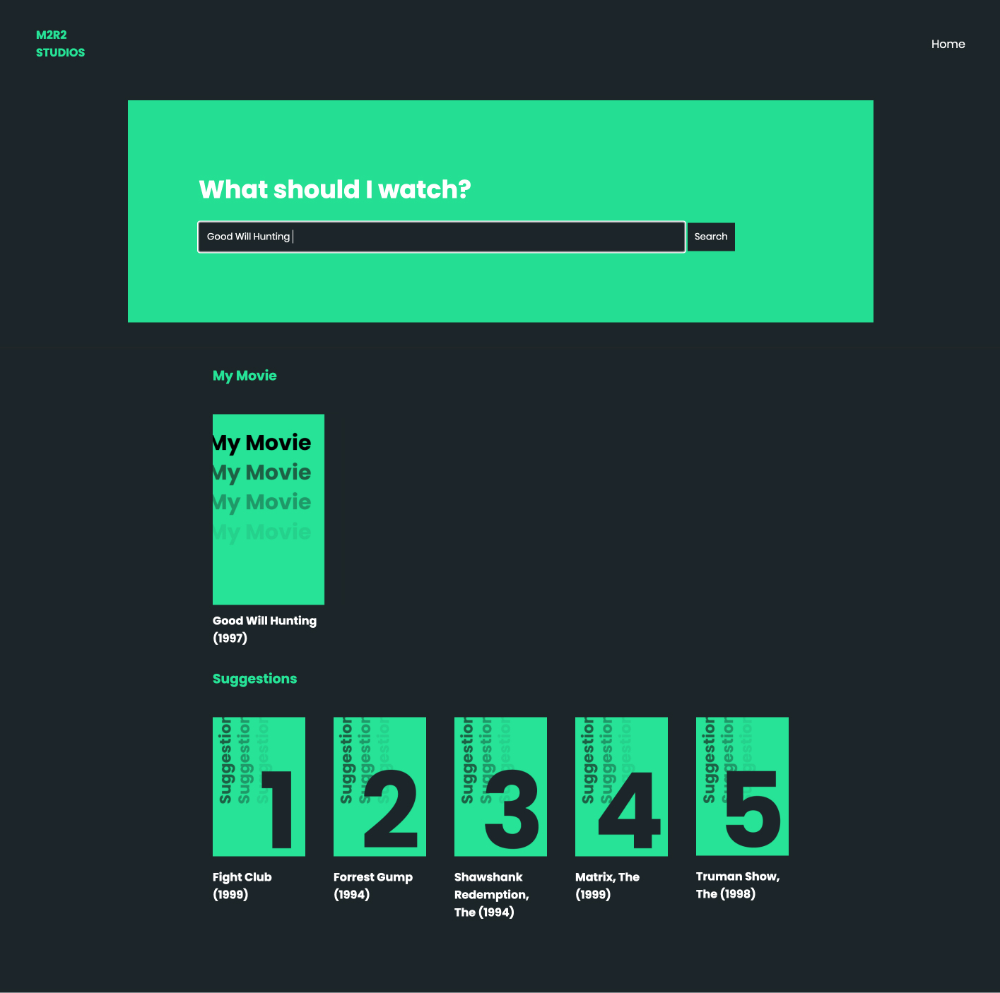

# M2R2 - Movie Recommendation Engine

AI & Machine Learning App developed using **Python** (scikit-learn, KNN Algorithm), **Flask**, **HTML** and **CSS**. Fictional project requested by a Movie Theather, that searches for movie recommendations based on the user's input and gives results according to user's recommendations.

Datasets used: [MovieLens](https://grouplens.org/datasets/movielens/)

Project developed at: [Wild Code School, Lisbon](https://github.com/WildCodeSchool)

Here´s the app preview:

#machine_learning #ml #ai #programming #flask #html #css #python
