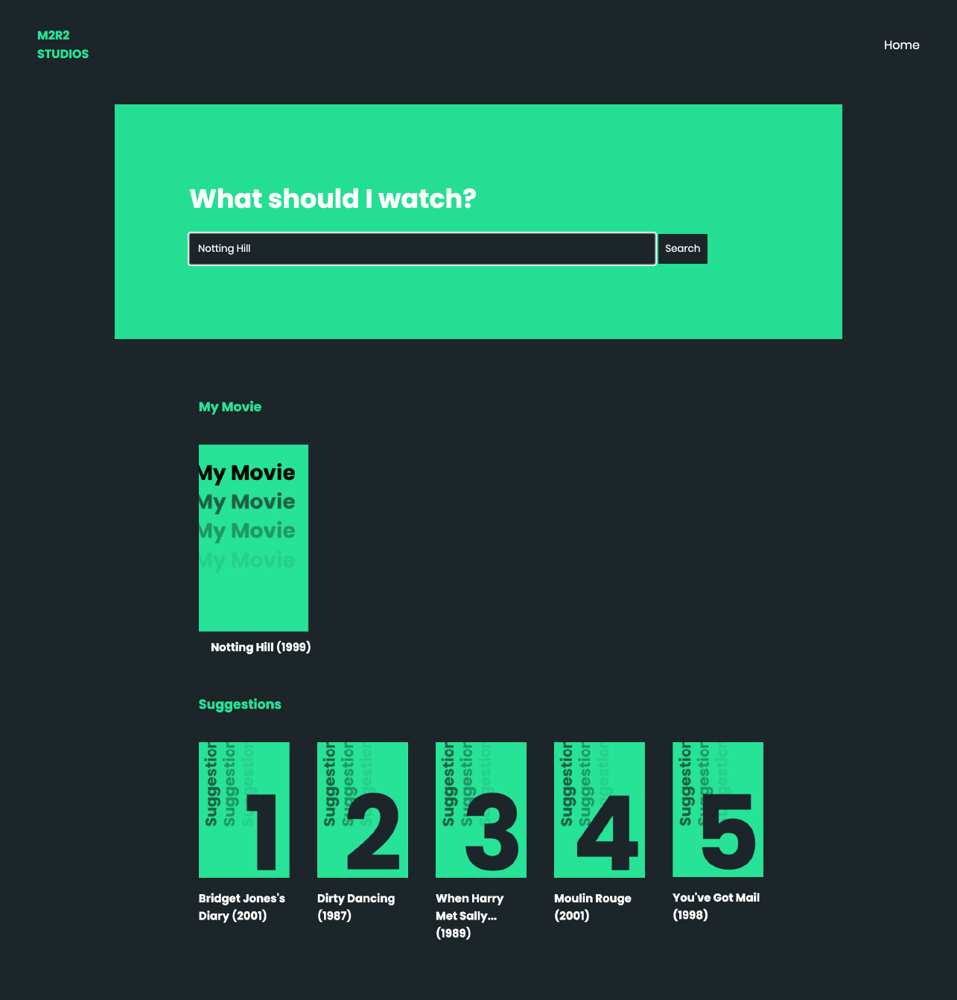

# M2R2 - Movie Recommendation Engine

AI & Machine Learning App developed using **Python** (scikit-learn, KNN Algorithm), **Flask**, **HTML** and **CSS**. Fictional project requested by a Movie Theather, that searches for movie recommendations based on the user's input and gives results according to user's recommendations.

Datasets used: [MovieLens](https://grouplens.org/datasets/movielens/)

Project developed at: [Wild Code School, Lisbon](https://github.com/WildCodeSchool)

Created by: 
  - [Mariana Moreira](https://www.linkedin.com/in/marianacormoreira/)
  - [Miguel Mimoso](https://www.linkedin.com/in/miguelvitalmimoso/)
  - [Renato Neto](https://www.linkedin.com/in/rmunhozneto/)
  - [Rita Goncalves](https://www.linkedin.com/in/ritavigoncalves/)

Here´s a sneak peak into our app ;)

To see the whole project, download the folders and run it locally. Enjoy!

#machine_learning #ml #ai #programming #flask #html #css #python
